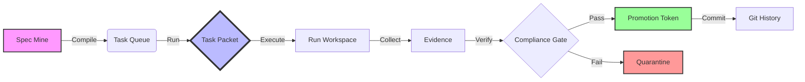

# dopeTask is a deterministic task-packet execution kernel that plans one path or refuses with evidence.

## Guarantees

- Artifact-first: if it did not write an artifact, it did not happen.
- Refusal-first: invalid or unsafe inputs produce a structured refusal with a stable exit code.
- Deterministic: identical packet + declared inputs + dopeTask version yields identical outputs.
- Single-path: no hidden retries, no fallback runners, no background execution.

## Kernel Manifesto

dopeTask is strict by design:

- one packet, one scoped objective
- one path, or explicit refusal with evidence
- one artifact trail that can be verified end to end

The goal is operational trust, not convenience theater.

## Anti-Features

dopeTask intentionally does not provide:

- hidden retries
- silent fallbacks to alternate runners
- undocumented file writes
- background mutation outside declared packet scope

## Kernel FAQ

**Why does dopeTask refuse so often?**  
Because refusal protects determinism and keeps artifacts trustworthy.

**Why require proof bundles?**  
Because claims without command output are not verifiable.

**Why avoid background behavior?**  
Because state changes must remain explicit, local, and auditable.

## Determinism Stress Test

Re-run the same packet under the same inputs and version.  
If outputs differ, treat it as a bug and capture evidence before retrying.

## Install

[Setup](docs/01_SETUP.md) • [Release Guidelines](docs/90_RELEASE.md) • [Contributing](CONTRIBUTING.md) • [Security Policy](SECURITY.md)

</div>

---

## 🦾 What is dopeTask?

Imagine a task runner that doesn't trust the internet, doesn't trust your system clock, and definitely doesn't trust random file mutations. That's **dopeTask**.

dopeTask is a rigorous system for managing the lifecycle of **"Task Packets"**—self-contained units of work. It is built for environments where "it works on my machine" is considered an admission of guilt.

### 🌟 Why You'll Love It (Or Fear It)

- **🔮 Deterministic Time Travel**: We mock time. Literal time. Your builds will produce the exact same artifacts today, tomorrow, and in 2050.
- **🛡️ The Great Allowlist**: Files don't just "change." They apply for a visa. Our `AllowlistDiff` system catches unauthorized mutations before they even think about becoming a commit.
- **🔌 Offline by Design**: dopeTask assumes the internet is down. If your build needs `npm install` to run, go back to square one.
- **🧬 Audit Trails**: Every run produces a forensic verification trail. Who ran it? When? with what inputs? It's all in the JSON.

---

## 🔄 The Lifecycle

dopeTask treats code changes as a manufacturing pipeline.



1.  **Compile**: Task definitions are mined from your specs and compiled into immutable packets.
2.  **Run**: A packet is executed in an isolated workspace.
3.  **Gate**: The output is scanned. Did it touch a file it wasn't supposed to? **REJECTED.**
4.  **Promote**: Only if the gate passes do you get a `PROMOTION.json` token.
5.  **Commit**: You cannot commit without a token. (We check.)

---

## Deterministic Task Execution

dopeTask uses isolated git worktrees and explicit per-packet commits to ensure:

- linear `main` history
- one JSON TP = one isolated committed unit
- one TP series = one cumulative PR branch
- deterministic rebases and fast-forward merges
- zero accidental commits on `main`

For new supervisor-driven work, use `dopetask tp series exec <packet.json>` for each ready packet in the series and `dopetask tp series finalize <series-id>` once the final packet is complete.

See [docs/13_TASK_PACKET_FORMAT.md](/Users/hue/code/dopeTask/docs/13_TASK_PACKET_FORMAT.md) for the JSON packet contract, [docs/24_UPGRADE_GUIDE.md](/Users/hue/code/dopeTask/docs/24_UPGRADE_GUIDE.md) for migration notes, and [docs/20_WORKTREES_COMMIT_SEQUENCING.md](/Users/hue/code/dopeTask/docs/20_WORKTREES_COMMIT_SEQUENCING.md) for the legacy markdown packet + commit-sequence path.

---

## 🚀 Quick Start

Get up and running faster than you can say "idempotency."

### 1. Installation

You can install dopeTask via `pip`, `uv`, or our unified installer script.

**Using uv (Recommended):**

```bash
uv tool install dopetask
dopetask --version
```

**Using pip:**

```bash
pip install dopetask
```

**Using the Unified Installer (for Repo Wiring):**

The installer script sets up a pinned environment and repository integration:

```bash
# Latest stable version
curl -fsSL https://raw.githubusercontent.com/DDD-Enterprises/dopeTask/main/scripts/install.sh | bash
```

*Need manual installation or wheel support? Check the [Detailed Setup Guide](docs/01_SETUP.md).*

### 2. The "Hello World" Loop

Let's run a loop. A loop creates tasks, runs them, checks them, and promotes them.

```bash
dopetask --help
```

See `docs/01_SETUP.md` for setup details and `docs/22_WORKFLOW_GUIDE.md` for the JSON TP series workflow.

## 60-second example

```bash
dopetask route init --repo-root .
cat > PACKET.md <<'EOF'
# Packet
ROUTER_HINTS:
  risk: low
EOF
dopetask route plan --repo-root . --packet PACKET.md
ls -1 out/dopetask_route/
```

Expected outputs:

- `out/dopetask_route/ROUTE_PLAN.json`
- `out/dopetask_route/ROUTE_PLAN.md`
- `out/dopetask_route/HANDOFF.md` (for handoff flows)

## Docs

- Current user/operator docs:
  `docs/00_OVERVIEW.md`, `docs/01_SETUP.md`, `docs/13_TASK_PACKET_FORMAT.md`, `docs/22_WORKFLOW_GUIDE.md`, `docs/23_INTEGRATION_GUIDE.md`, `docs/24_UPGRADE_GUIDE.md`
- Beginner onboarding:
  `docs/beginner/00_WELCOME.md`, `docs/beginner/01_CONCEPTS.md`, `docs/beginner/02_INSTALLATION.md`, `docs/beginner/03_WEB_LLM_SETUP.md`, `docs/beginner/04_WORKFLOW.md`
- Legacy/manual maintainer docs:
  `docs/20_WORKTREES_COMMIT_SEQUENCING.md`, `docs/TP_GIT_WORKFLOW.md`
- Proof-contract docs:
  `docs/proof/PROOF_BUNDLE_CONTRACT.md`, `docs/proof/PROOF_ARCHIVE_POLICY.md`, `docs/proof/BUNDLE_REVIEW_GUIDE.md`, `docs/proof/DOPETASK_BUNDLE_SCHEMA.md`
- Audit artifact docs:
  `docs/91_CONTRACT_AUDIT_SCHEMA.md`, `docs/92_CONTRACT_CLAIMS_INVENTORY.md`, `docs/93_CONTRACT_AUDIT_REPORT.md`, `docs/94_CONTRACT_REMEDIATION_BACKLOG.md`

- Overview: `docs/00_OVERVIEW.md`
- Setup: `docs/01_SETUP.md`
- Beginner welcome: `docs/beginner/00_WELCOME.md`
- Architecture: `docs/10_ARCHITECTURE.md`
- Public contract: `docs/11_PUBLIC_CONTRACT.md`
- Router: `docs/12_ROUTER.md`
- Task packet format: `docs/13_TASK_PACKET_FORMAT.md`
- Project doctor: `docs/14_PROJECT_DOCTOR.md`
- Workflow guide: `docs/22_WORKFLOW_GUIDE.md`
- Integration guide: `docs/23_INTEGRATION_GUIDE.md`
- Upgrade guide: `docs/24_UPGRADE_GUIDE.md`
- Consumer install: `docs/25_CONSUMER_INSTALL.md`
- Worktrees and commit sequencing (legacy maintainers): `docs/20_WORKTREES_COMMIT_SEQUENCING.md`
- Case bundles (maintainers): `docs/21_CASE_BUNDLES.md`
- Release (maintainers): `docs/90_RELEASE.md`

## Kernel vs ecosystem

dopeTask (kernel) validates packets, plans deterministically, executes one path (or emits a manual handoff), and writes canonical artifacts.

Everything else (scheduling, orchestration, memory, UX) belongs in the ecosystem above the kernel.
