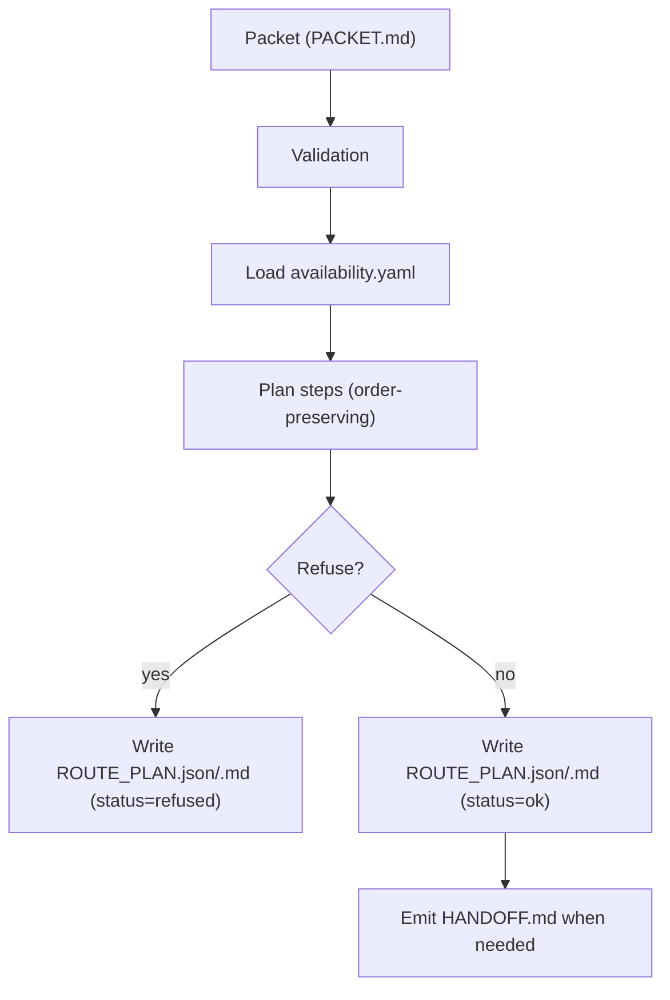

> **ARCHITECTURE ROLE:** The router belongs to the Reference Architecture Plane. It provides normative deterministic planning logic but is not the default path for automated series execution.

# Router

dopeTask Router v1 selects runner/model pairs deterministically and writes route artifacts.
This doc covers the router plane.
The router is an active, non-default planning/handoff surface.
It is not the default operator execution workflow.

See `10_ARCHITECTURE.md` for kernel principles.

## Flow


```mermaid
flowchart TD
  A["Packet (PACKET.md)"] --> B["Validation"]
  B --> C["Load availability.yaml"]
  C --> D["Plan steps (order-preserving)"]
  D --> E{"Refuse?"}
  E -- "yes" --> F["Write ROUTE_PLAN.json/.md (status=refused)"]
  E -- "no" --> G["Write ROUTE_PLAN.json/.md (status=ok)"]
  G --> H["Emit HANDOFF.md when needed"]
```

This flow covers route planning only.
It does not execute packets or replace run, proof, or series-state surfaces.

## Commands

```bash
dopetask route init --repo-root .
dopetask route plan --repo-root . --packet PACKET.md
dopetask route handoff --repo-root . --packet PACKET.md
dopetask route explain --repo-root . --packet PACKET.md --step run-task
```

## Config

`dopetask route init` writes:

- `.dopetask/runtime/availability.yaml`

## claude_code routing state

`claude_code` is present in the router availability template and in generated `.dopetask/runtime/availability.yaml`.
TP-DT-CLAUDE-ROUTING-READINESS-0001 produced a route plan with `status: ok`; that plan selected `claude_code` with `sonnet-4.6` for `run-task`, and the handoff/report output included Claude Code handoff text.

This does not make route/orchestrate the default execution path.
The implemented Claude Code execution path for MVP0 is the TP series and low-level executor plane:

```bash
dopetask tp series exec --agent claude_code <packet.json>
```

That path flows through `tp_series -> tp_exec/engine.py -> dopetask_adapters/claude_code/ClaudeCodeExecutor`.

Boundaries:

- `src/dopetask/runners/claude_code.py` and `orchestrator/kernel.py` remain separate route/orchestrate runner surfaces and are deferred.
- `dope-agent-system` remains a template/reference asset plane. It is not runtime authority and is not integrated into MVP0 execution.
- PAL/clink remains planning/context only, not execution transport.
- `--bare` is not a default mode and must not be introduced as an implicit fallback.

## Deterministic artifacts

These are route-plane artifacts, not the main operator record for every workflow.

- `out/dopetask_route/ROUTE_PLAN.json`
- `out/dopetask_route/ROUTE_PLAN.md`
- `out/dopetask_route/HANDOFF.md`

## Refusal conditions and artifacts

Planner exits with code `2` when:

- required runner/model pairs are unavailable
- top score is below threshold

In refusal mode, plan artifacts are still written with:

- `status: refused`
- refusal reasons
- top candidates per step
